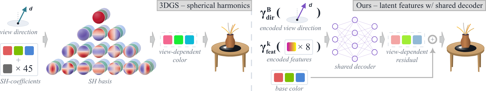

# Compact Neural Appearance Models for Efficient Gaussian Splatting
&nbsp;
&nbsp;
&nbsp;
&nbsp;
[](./LICENSE)

<picture>
  <source media="(prefers-color-scheme: dark)" srcset="resources/teaser_dark.png">
  
</picture>

__Spherical harmonics are the default but neither the best nor the most efficient appearance model for 3DGS.__  
This repository extends [Faster-GS](https://github.com/nerficg-project/faster-gaussian-splatting) with a pluggable view-dependent appearance system: spherical harmonics, recent spherical alternatives, and our compact neural model, all fused into the same differentiable CUDA rasterizer and all supported by a portable WebGL viewer.
It is the official implementation of “_Compact Neural Appearance Models for Efficient Gaussian Splatting_”.
We built the complete pipeline, from optimization to a viewer that runs on phones, not to replace existing tools but to give their developers a tested reference for moving beyond spherical harmonics.

> __Compact Neural Appearance Models for Efficient Gaussian Splatting__  
> [Florian Hahlbohm](https://fhahlbohm.github.io), [Jorge Condor](https://arcanous98.github.io/), [Linus Franke](https://lfranke.github.io/), [Martin Eisemann](https://graphics.tu-bs.de/people/eisemann), [Marcus Magnor](https://graphics.tu-bs.de/people/magnor)  
> _arXiv, 2026_  
> __[Project page](https://fhahlbohm.github.io/efficient-gaussian-appearance)&nbsp;| [Paper](https://fhahlbohm.github.io/efficient-gaussian-appearance/assets/hahlbohm2026efficientgaussianappearance.pdf)&nbsp;| [Viewer](https://fhahlbohm.github.io/efficient-gaussian-appearance/viewer/)&nbsp;| [BibTeX](https://fhahlbohm.github.io/efficient-gaussian-appearance/assets/hahlbohm2026efficientgaussianappearance.bib)__


## Overview

In 3D Gaussian Splatting (3DGS), third-degree spherical harmonics (SH) account for most of the parameters stored per primitive, and thus for most of the optimizer state and memory traffic during optimization and rendering.
Our paper presents a controlled, end-to-end comparison of SH and recent spherical appearance models within a single optimized pipeline, and introduces a neural alternative that decodes compact per-primitive latent codes with a tiny shared MLP.

This repository is that pipeline: a Faster-GS variant in which the appearance model is a swappable component.
Everything else, from the optimized rasterizer to MCMC densification, PPISP, and warp-level culling, is inherited unchanged from the `main` branch of Faster-GS.
If you are interested in the details, we recommend you read our paper.

__Appearance models__ (`Appearance/`, selected via `MODEL.APPEARANCE.TYPE`):

| Type       | Model                                                                                                                                  | Config                      |
|------------|----------------------------------------------------------------------------------------------------------------------------------------|-----------------------------|
| `SH`       | Spherical harmonics as in [3DGS](https://repo-sam.inria.fr/fungraph/3d-gaussian-splatting/)                                            | `fastergsvda_sh.yaml`       |
| `SV`       | [Spherical Voronoi](https://sphericalvoronoi.github.io/): a soft partition of the direction sphere                                     | `fastergsvda_sv.yaml`       |
| `NASG`     | Normalized anisotropic spherical Gaussians as in [Beyond Spherical Harmonics](https://arcanous98.github.io/projectPages/beyondSH.html) | `fastergsvda_nasg.yaml`     |
| `NASGabor` | NASG lobes with an additional Gabor term from [Beyond Spherical Harmonics](https://arcanous98.github.io/projectPages/beyondSH.html)    | `fastergsvda_nasgabor.yaml` |
| `Neural`   | Ours: per-primitive latent codes decoded by a tiny shared MLP ([tiny-cuda-nn](https://github.com/NVlabs/tiny-cuda-nn) `FullyFusedMLP`) | `fastergsvda_neural.yaml`   |

`fastergsvda_none.yaml` trains view-independent colors (degree-0 SH) as a lower bound.
All models share the same color formulation, `color = color_activation(base_activation(base) + residual(direction))`, with the activations chosen in the config (`BASE_ACTIVATION`, `RESIDUAL_ACTIVATION`, `COLOR_ACTIVATION`).
The learning-rate schedules in the six configs are the ones used for the paper.

__Fused appearance evaluation:__  
Instead of one kernel per model, the rasterizer's preprocess kernels are JIT-compiled for the configured appearance model and activations using runtime code generation ([`rasterization/rtc/`](FasterGSVDACudaBackend/FasterGSVDACudaBackend/rasterization/rtc) in the CUDA backend).
The forward and backward passes of every model, including the MLP, run inside the rasterizer without separate launches or global memory round-trips.
Adding a model means adding one Python class to `Appearance/` and one CUDA chunk to `rasterization/rtc/`.
Set `RENDERER.USE_FUSED_APPEARANCE: false` to precompute colors outside the rasterizer instead, e.g., for debugging.

__WebGL viewer:__  
`viewer/` contains a standalone Three.js viewer that implements all five appearance models, the PPISP post-processing, and a benchmark mode over the baked test cameras, so the comparison extends to laptop and mobile GPUs.
It is hosted at https://fhahlbohm.github.io/efficient-gaussian-appearance/viewer/ together with a checkpoint for every scene and appearance model of the main benchmark (Table 1 in the paper).
See [viewer/README.md](viewer/README.md) for the file format, the export script, and how to run it locally.


## Installation

Our implementation is provided as an extension to [NeRFICG](https://github.com/nerficg-project), a radiance field and view synthesis framework actively maintained and developed by our research group.


### Requirements

- An NVIDIA GPU
- Linux (preferred) or Windows
- A recent CUDA SDK ([CUDA Toolkit 12.8](https://developer.nvidia.com/cuda-12-8-0-download-archive) recommended) and a compatible C++ compiler
- [Anaconda / Miniconda](https://www.anaconda.com/docs/getting-started/miniconda/install) installed


### Setup

As a preparatory step, the [NeRFICG framework](https://github.com/nerficg-project/nerficg) needs to be set up.
Please follow the instructions in its README to set up a compatible Conda environment.

Now add this method by cloning the repository, including the tiny-cuda-nn submodule, into `src/Methods/FasterGSVDA`:
```shell
# HTTPS
git clone --recursive https://github.com/nerficg-project/efficient-gaussian-appearance.git src/Methods/FasterGSVDA
```
or
```shell
# SSH
git clone --recursive git@github.com:nerficg-project/efficient-gaussian-appearance.git src/Methods/FasterGSVDA
```

Next, install all method-specific dependencies and CUDA extensions using:
```shell
python ./scripts/install.py -m FasterGSVDA
```

Installing the CUDA extension compiles tiny-cuda-nn from the submodule and copies the headers needed for runtime compilation into `FasterGSVDACudaBackend/rtc/`.
While doing so, it patches an upstream bug in tiny-cuda-nn's JIT backward pass (activation derivatives were evaluated on post-activation values, see [setup.py](FasterGSVDACudaBackend/setup.py#L86-L110)), which only affects smooth hidden activations.
JIT-compiled kernels are cached in `FasterGSVDACudaBackend/rtc/cache/`.

_Note: The framework determines on-the-fly what extra modules need to be installed. Sometimes this causes unnecessary errors/warnings that can interrupt the installation process. In this case, first try to rerun the command before investigating the error in detail._


## Usage

The method is fully compatible with the NeRFICG scripts in the `scripts/` directory.
This includes config file generation via `create_config.py`,
training via `train.py`/`sequential_train.py`/`benchmark.py`,
inference and performance benchmarking via `inference.py`,
exporting trained models to .ply files via `convert_to_ply.py`,
and interactive rendering via `gui.py`.

For example, training our neural appearance model on a Mip-NeRF 360 scene:
```shell
python scripts/train.py -c src/Methods/FasterGSVDA/fastergsvda_neural.yaml
```

`paper_configs/<experiment>/<appearance>/<scene>.yaml` contains every config used for the experiments in the paper.

Trained models can be exported for the web viewer (run from the NeRFICG root):
```shell
python src/Methods/FasterGSVDA/viewer/export_ngsplat.py output/FasterGSVDA/<run>
```

For detailed instructions, please refer to the [NeRFICG repository](https://github.com/nerficg-project/nerficg).


## Acknowledgements

We thank Timon Scholz for his contributions to the software infrastructure supporting this work and Jannis Möller for identifying and helping us fix a bug in tiny-cuda-nn.

This work was partially funded by the DFG projects
[Real-Action VR](https://graphics.tu-bs.de/projects/real-action-vr) (ID 523421583) and
[Increasing Realism of Omnidirectional Videos in Virtual Reality](https://graphics.tu-bs.de/projects/increasing-perceived-realism-in-omnidirectional-visual-media) (ID 491805996).

This repository builds on our own [Faster-GS](https://fhahlbohm.github.io/faster-gaussian-splatting) implementation; please see its [acknowledgements](https://github.com/nerficg-project/faster-gaussian-splatting#acknowledgements) for the works it integrates.

We thank the authors of the following works, whose ideas and open-source implementations form the foundation of the appearance models and the web viewer:
- Müller. [_tiny-cuda-nn._](https://github.com/NVlabs/tiny-cuda-nn) 2021.
- Di Sario et al. [_Spherical Voronoi: Directional Appearance as a Differentiable Partition of the Sphere._](https://sphericalvoronoi.github.io/) CVPR 2026.
- Miazga et al. [_Beyond Spherical Harmonics: Rethinking Appearance Models for Radiance Reconstruction._](https://arcanous98.github.io/projectPages/beyondSH.html) EGSR 2026.
- Duckworth et al. [_SMERF: Streamable Memory Efficient Radiance Fields for Real-Time Large-Scene Exploration._](https://smerf-3d.github.io/) SIGGRAPH 2024.

The web viewer builds on [Three.js](https://threejs.org/) and borrows its splat sorting from the [PlayCanvas engine](https://github.com/playcanvas/engine) and its packed Gaussian parameter and SH layouts from [Spark](https://sparkjs.dev/).


## License and Citation

This project is licensed under the Apache License 2.0 (see [LICENSE](LICENSE)).

If you use this project in your research, please cite our paper:

```bibtex
@misc{hahlbohm2026efficientgaussianappearance,
  title         = {Compact Neural Appearance Models for Efficient Gaussian Splatting},
  author        = {Florian Hahlbohm and Jorge Condor and Linus Franke and Martin Eisemann and Marcus Magnor},
  year          = {2026},
  eprint        = {2609.xxxxx},
  archivePrefix = {arXiv},
  primaryClass  = {cs.CV},
  url           = {https://arxiv.org/abs/2609.xxxxx},
}
```
